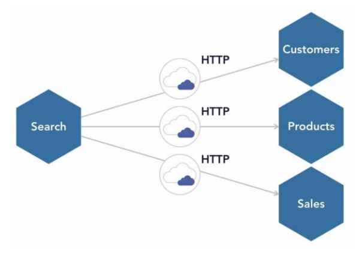

# Мікросервісна система

## Мета розробки

Вивчити особливості мікросервісної архітектури, отримати практичні навички розробки мікросервісів на платформі .NET Core в середовищі розробки Visual Studio 2019 (мова C#).

## Завдання

Розробити мікросервісну систему, що включає чотири мікросервіси: Products, Customers, Sales і Search.

Перші три мікросервіси повинні управляти власними даними. Вони повинні зберігати дані в пам'яті, хоча це швидко можна замінити на базу даних.  
Мікросервіс Search повинен синхронізовано взаємодіяти з іншими мікросервісами для отримання даних від конкретного користувача. Мікросервіс Search повинен повертати об'єднані дані. Для досягнення цього ми повинні вирішити наступні завдання:

1. Ми розробимо мікросервіси, використовуючи Visual Studio 2019 і .NET Core.
2. Потім ми створимо образи (image) для контейнера Docker і Docker Composer скрипт для локального відлагодження.
3. Далі ми помістимо (push) вихідний код до централізованого репозиторію, подібного Azure DevOps.
4. Далі з використанням комунікаційних магістралей (pipelines) робимо численні побудови (build) і релізи (release), щоб впевнитись, що все працює так, як потрібно, і щоб побудувати образи (image) для контейнера Docker.
5. Після цього ми заштовхнемо (push) образи Docker в Container Registry. Для прикладу, в Docker Hub і Azure Container Registry.
6. І на завершення ми розгорнемо всі контейнери в Azure Service Fabric Cluster.
