# Дослідження можливостей генерації коду моделі ШІ OpenAI gpt-4o-mini

## Мета

Дослідити особливості моделі **gpt-4o-mini** при виконанні завдвннь з генерації коду відносно складного, комплексного проєкту з нуля та порівняти результати з іншими моделями. Визначити відносну ефективність моделі.

**Крітерії оцінювання:**

- Повнота виконання вимог
- Якість логіки, архітектури, файлової структури та дотримання кращіх практик
- Кількість випадків навмисно скороченого коду (модель залишає коментарі про недописані частини коду без відсутності необхідних даних)
- Кількість випадків не навмисно не написаного коду (відсутні імпорти залежностей у файлах або не враховані методи)
- Кількість випадків помилок або галюцинацій
- Загальна кількість запитів до моделі для допрацювання та виправлення (не включаючи запити, на які модель навмисно розподіляє виконання усього завдання)
- Кількість виправлень та доповнень внесених розробником для запуску усієї системи

## Задача для виконання

Завдання (prompt) на генерацію коду для ASP.NET Solution системи з чотирьох взаємодіючих мікросервісів, три з яких підключаються до окремих баз даних, однієї простої веб сторінки, з документацією до API дивитися у файлі - [PromptECommerceMySQL.md](PromptECommerceMySQL.md). Основна задача - успішне виконання запиту до API Search для пошуку усіх замовлень користувача включно з загальним списком замовлених продуктів у відповідності до вимог до схеми відповіді.
Використаний промпт розроблявся на протязі навчального семестру під час виконання лабораторних робіт з розробки мікросервісної архітектури описом - [Lab.md](Lab.md).

## Результати

ASP.NET Solution виконує основну задачу - пошук усіх заказів користувача за його CustomerId. При цьому вимоги не були виконані в повному обсязі відповідно до завдання, не оброблені випадки негативних сценаріїв, відносно багато навмисного скорочення коду (функціоналу) та ненавмисних упущень та помилок. Загальна кількість запитів до API - 7. Приблизний час затрачений до виконання основної задачі - 5 годин.

## Історія повідомлень чату

Файл [.simpler/conversations/conversation-2024-12-27T20-20-22.json](.simpler/conversations/conversation-2024-12-27T20-20-22.json) містить історію повідомлень у запитах до моделі та її відповідях.

## Параметри запитів до API

Парамети останнього запиту до `https://api.openai.com/v1/chat/completions` API OpenAI, який містить повну історію повідомлень (скорочення повідомлень здійснено браузерною консоллю), представлені у файлі [api-request.json](api-request.json). Запити виконувалися з використанням методом `await generateText(options)` з `Vercel AI SDK` (`npm` бібліотеки `ai` та `@ai-sdk/openai`).

## Параметри відповіді API

Параметри відповіді API OpenAI приведено у файлі [api-response.json](api-response.json). Серед параметрів є використання токенів (для останнього запиту):

```json
{
    "usage": {
        "promptTokens": 12032,
        "completionTokens": 808,
        "totalTokens": 12840
    }
}
```

## Зміни та виправлення коду внесені розробником

Комміт [`2190c65ef35fc6543e76927f735c5918da95a2ca`](https://github.com/gitkola/ECommerce-gpt-4o-mini-test-prompting/commit/2190c65ef35fc6543e76927f735c5918da95a2ca) містить практично усі виправлення коду розробником без участі моделі.

## GPT-4o mini

GPT-4o mini (“o” for “omni”) is a fast, affordable small model for focused tasks. It accepts both text and [image inputs](/docs/guides/vision), and produces [text outputs](/docs/guides/text-generation) (including [Structured Outputs](/docs/guides/structured-outputs)). It is ideal for [fine-tuning](/docs/guides/fine-tuning), and model outputs from a larger model like GPT-4o can be [distilled](/docs/guides/distillation) to GPT-4o-mini to produce similar results at lower cost and latency. Faster model, lower price per token.

The knowledge cutoff for GPT-4o-mini models is **October, 2023**.

`gpt-4o-mini` (`gpt-4o-mini-2024-07-18`) has **context length** of `128,000` tokens and `16,384` max output tokens.

## Демонстраційні зображення

Файли виправлені розробником (за виключенням 4-х файлів зображень)

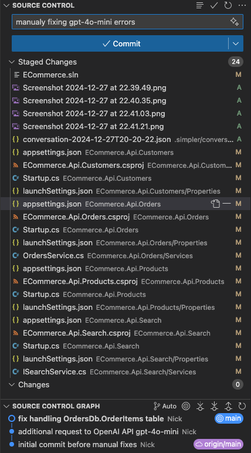

Бази даних CustomersDb, OrdersDb, ProductsDb

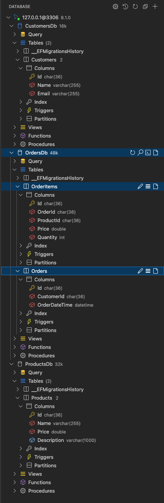

Таблиця Customers

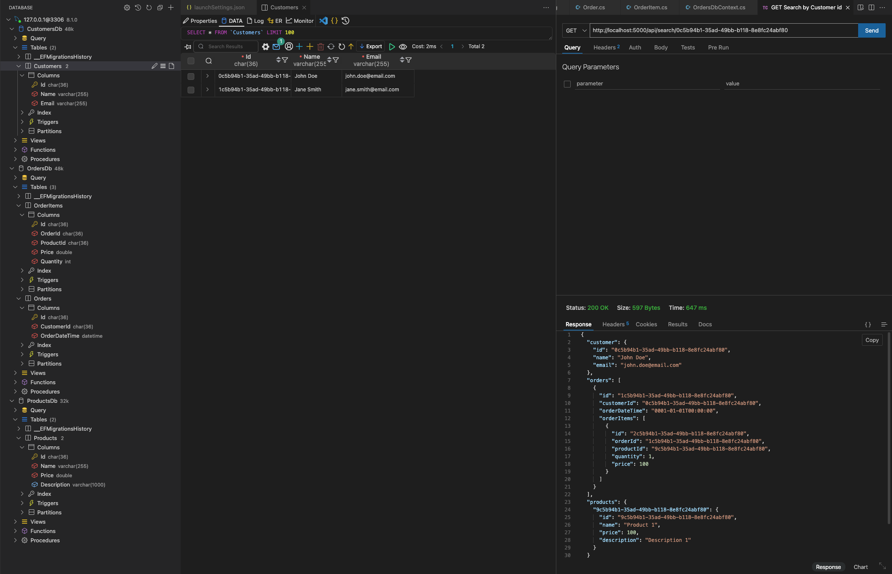

Таблиця Products

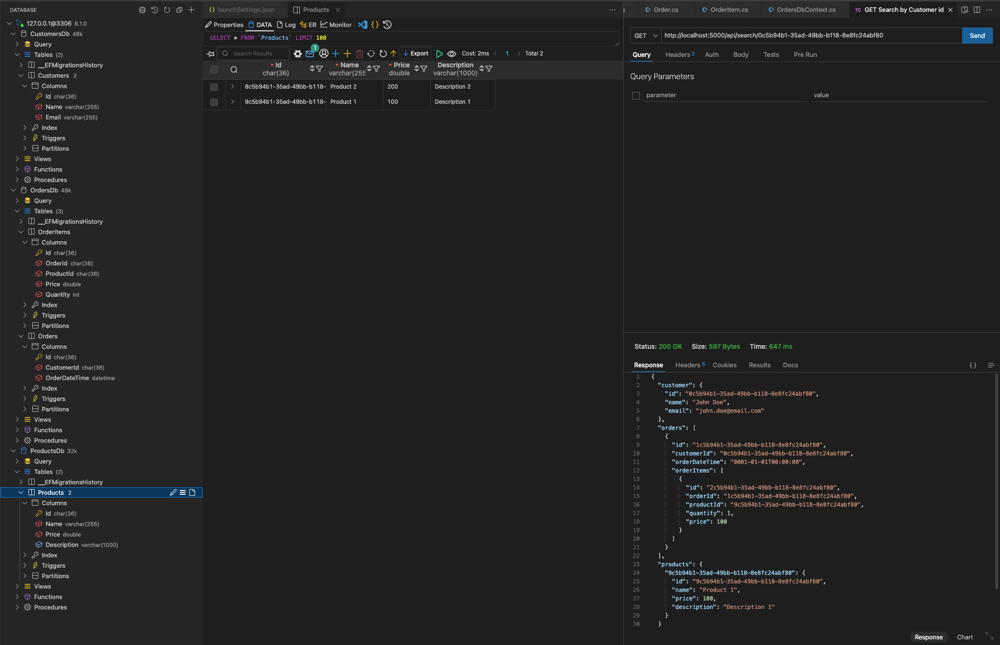

Таблиця OrderItems

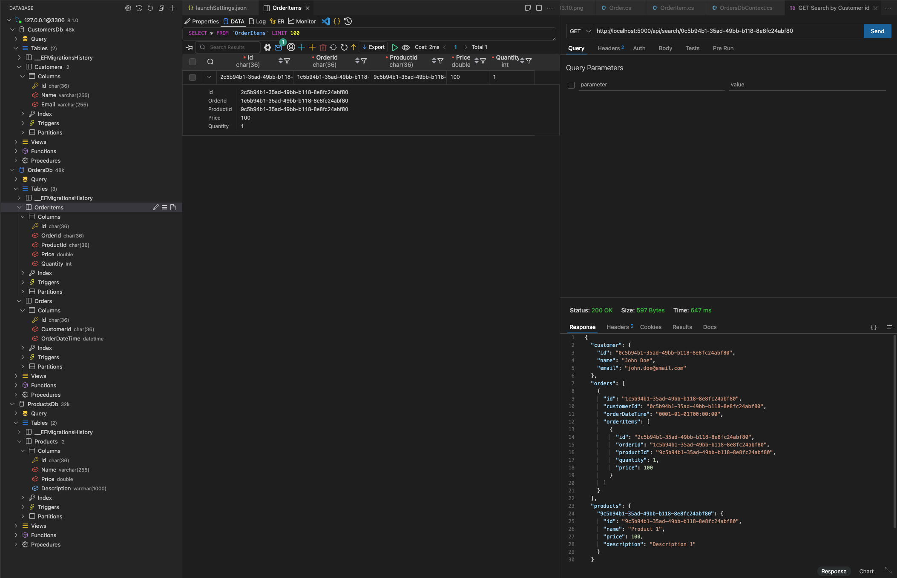

Таблиця Orders

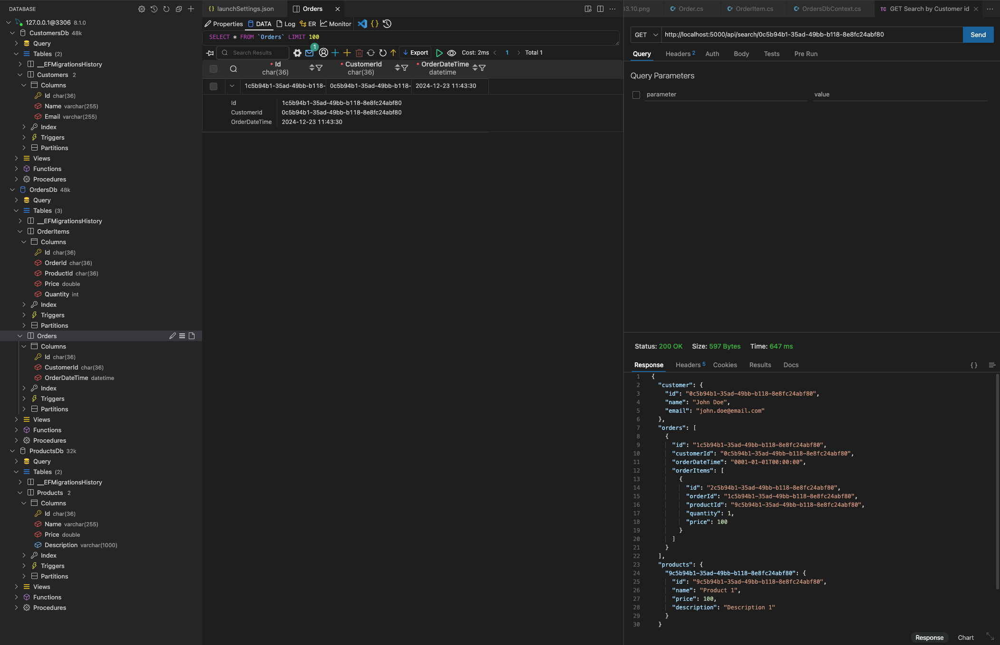

Search web-page

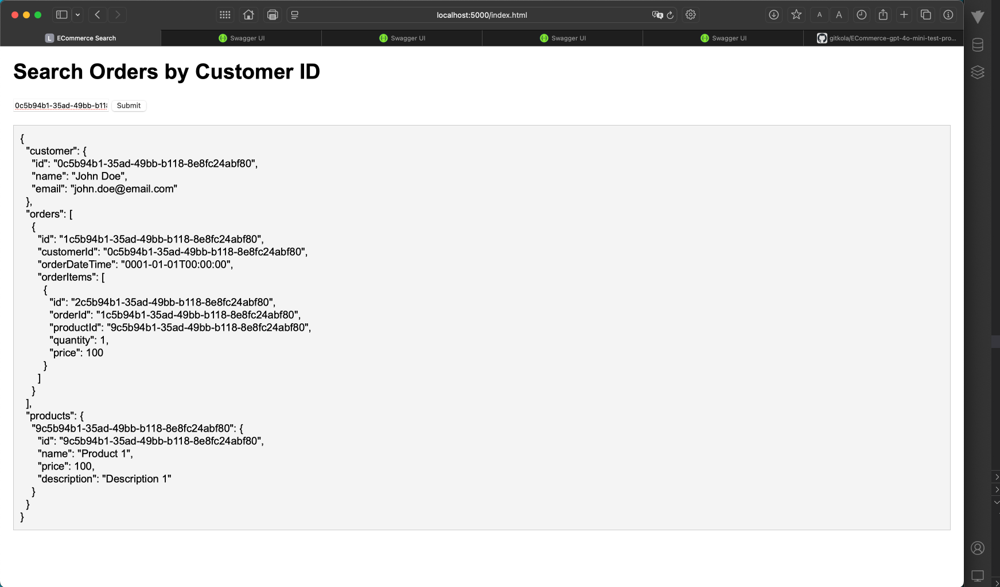

Search Swagger Doc

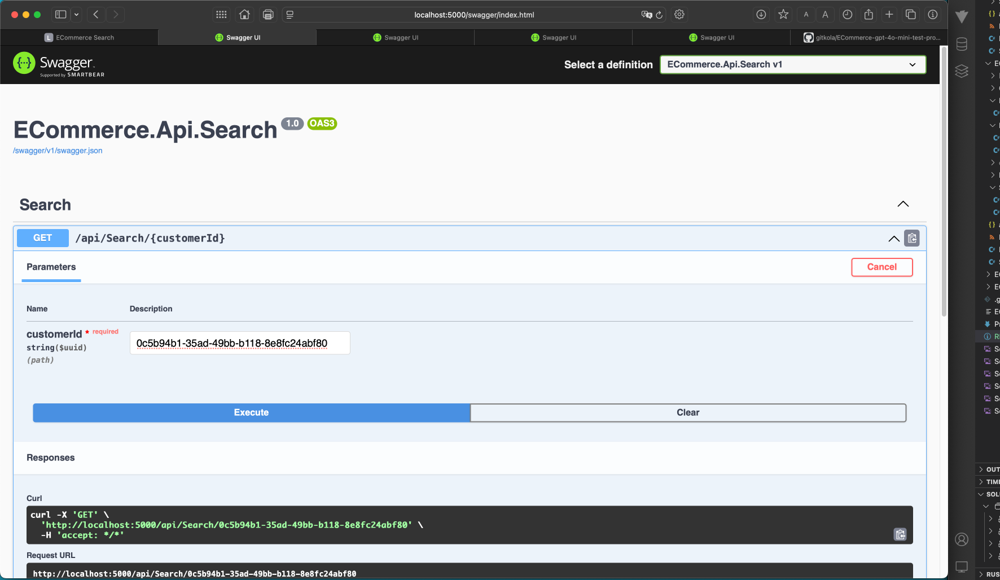

Products Swagger Doc

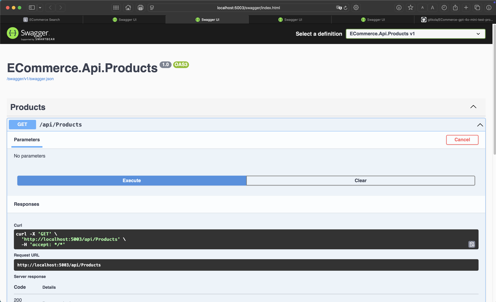


Customers Swagger Doc

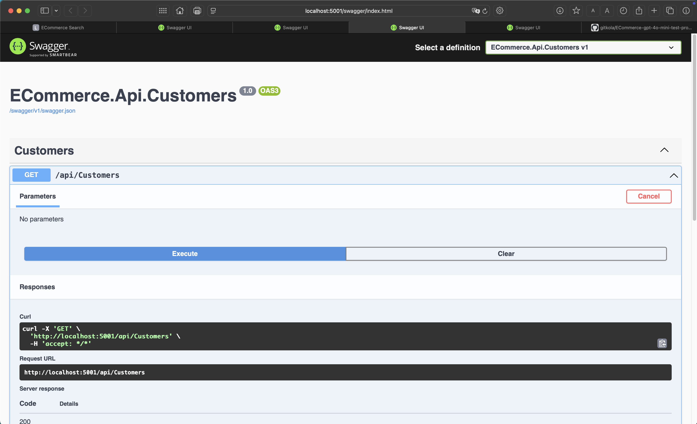

Orders Swagger Doc

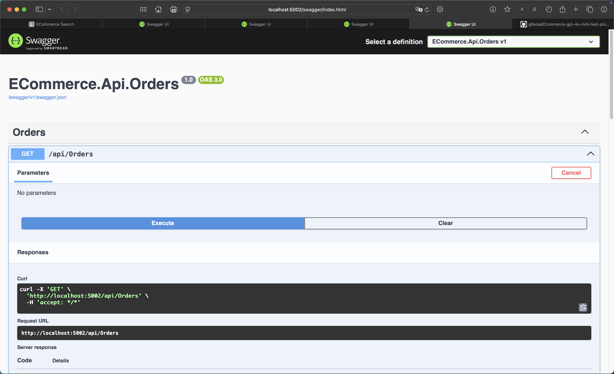

